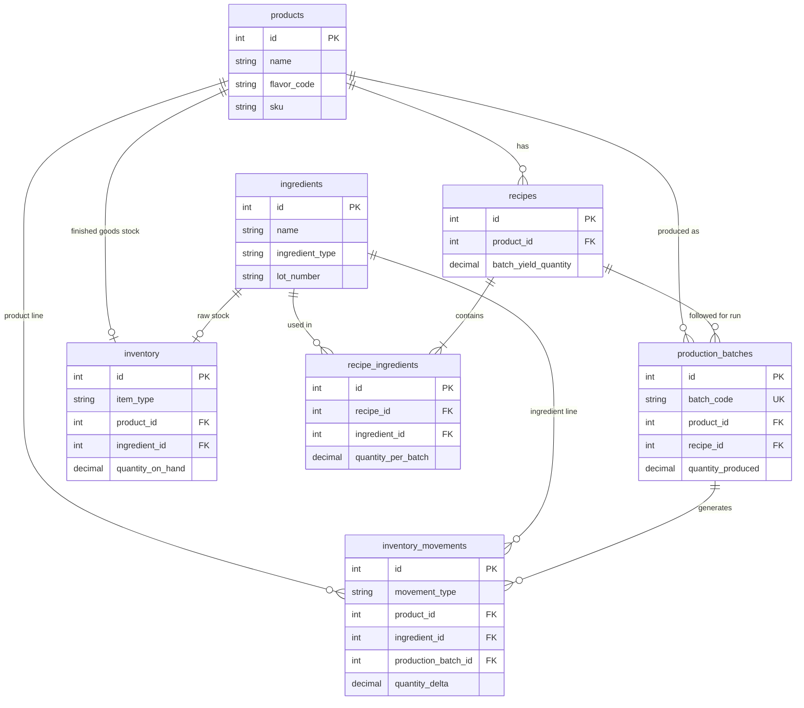

# Inventory PollysPop — Database Schema

PollysPop tracks soda production from raw ingredients through finished goods. The schema separates **catalog** data (what exists), **recipes** (how to make it), **inventory** (what you have now), **production** (what you made), and **movements** (every stock change for audit).

---

## Entity relationship overview



---

## Table reference

### `products`

**Purpose:** Catalog of finished sodas you sell or hold as finished goods.

Each row is one sellable product (e.g. Cherry Soda, Orange Soda, Blue Raspberry). The `flavor_code` is a short token used in production batch IDs.

| Column | Type | Notes |
|--------|------|-------|
| `id` | PK | Surrogate key |
| `name` | text | Display name, e.g. `Cherry Soda` |
| `flavor_code` | text, unique | 3-letter code for batch string, e.g. `CHR`, `ORG`, `BLR` |
| `sku` | text, unique | Optional product / barcode identifier |
| `unit` | text | Finished-goods unit, e.g. `case`, `bottle` |
| `is_active` | boolean | Soft-disable without deleting history |
| `created_at` | timestamptz | Row creation time |

**Connects to:**

| Relationship | Table | FK column | Cardinality |
|--------------|-------|-----------|-------------|
| Product has recipes | `recipes` | `recipes.product_id` → `products.id` | 1 : many |
| Product is produced in batches | `production_batches` | `production_batches.product_id` → `products.id` | 1 : many |
| Product stock level | `inventory` | `inventory.product_id` → `products.id` | 1 : 0..1 |
| Product movement history | `inventory_movements` | `inventory_movements.product_id` → `products.id` | 1 : many |

**Example rows:**

| name | flavor_code | sku |
|------|-------------|-----|
| Cherry Soda | CHR | PP-CHR-12 |
| Orange Soda | ORG | PP-ORG-12 |
| Blue Raspberry | BLR | PP-BLR-12 |

---

### `ingredients`

**Purpose:** Raw materials and consumables used in production — syrups (often tracked by lot), water, CO₂, bottles, caps, labels, etc.

Syrup lots can be distinguished with `lot_number` and optional `expires_at` so you know which lot was consumed when tracing a batch.

| Column | Type | Notes |
|--------|------|-------|
| `id` | PK | Surrogate key |
| `name` | text | e.g. `Cherry Syrup`, `12oz Bottle` |
| `ingredient_type` | text | e.g. `syrup`, `water`, `co2`, `packaging` |
| `lot_number` | text, nullable | Syrup / supplier lot; null for generic items like water |
| `unit` | text | e.g. `L`, `kg`, `each` |
| `supplier` | text, nullable | Optional vendor name |
| `expires_at` | date, nullable | Relevant for perishable syrups |
| `is_active` | boolean | Soft-disable |
| `created_at` | timestamptz | Row creation time |

**Connects to:**

| Relationship | Table | FK column | Cardinality |
|--------------|-------|-----------|-------------|
| Ingredient appears in recipes | `recipe_ingredients` | `recipe_ingredients.ingredient_id` → `ingredients.id` | 1 : many |
| Ingredient stock level | `inventory` | `inventory.ingredient_id` → `ingredients.id` | 1 : 0..1 |
| Ingredient movement history | `inventory_movements` | `inventory_movements.ingredient_id` → `ingredients.id` | 1 : many |

**Note:** If you need separate stock per syrup lot, use one `ingredients` row per lot (same name, different `lot_number`) rather than one row for all cherry syrup.

---

### `recipes`

**Purpose:** Defines how to make **one batch** of a product — the BOM (bill of materials) header.

One product typically has one active recipe; you can keep older versions by setting `is_active = false` on superseded rows.

| Column | Type | Notes |
|--------|------|-------|
| `id` | PK | Surrogate key |
| `product_id` | FK → `products.id` | Which finished product this recipe produces |
| `name` | text | e.g. `Cherry Soda — standard batch` |
| `batch_yield_quantity` | decimal | Units produced per batch, e.g. `24` cases |
| `batch_yield_unit` | text | Should match `products.unit` |
| `version` | int | Increment when formula changes |
| `is_active` | boolean | Only one active recipe per product (enforced in app or partial unique index) |
| `created_at` | timestamptz | Row creation time |

**Connects to:**

| Relationship | Table | FK column | Cardinality |
|--------------|-------|-----------|-------------|
| Recipe belongs to product | `products` | `recipes.product_id` | many : 1 |
| Recipe lists ingredients | `recipe_ingredients` | `recipe_ingredients.recipe_id` → `recipes.id` | 1 : many |
| Recipe used on production run | `production_batches` | `production_batches.recipe_id` → `recipes.id` | 1 : many |

---

### `recipe_ingredients`

**Purpose:** Junction table linking a recipe to its ingredients with **quantity per batch**.

This is how “Cherry Soda recipe = 2.5 L cherry syrup + 50 L water + …” is stored.

| Column | Type | Notes |
|--------|------|-------|
| `id` | PK | Surrogate key |
| `recipe_id` | FK → `recipes.id` | Parent recipe |
| `ingredient_id` | FK → `ingredients.id` | Raw material |
| `quantity_per_batch` | decimal | Amount consumed to make one full batch yield |
| `unit` | text | Should match `ingredients.unit` |

**Connects to:**

| Relationship | Table | FK column | Cardinality |
|--------------|-------|-----------|-------------|
| Line belongs to recipe | `recipes` | `recipe_id` | many : 1 |
| Line references ingredient | `ingredients` | `ingredient_id` | many : 1 |

**Constraints:**

- `UNIQUE (recipe_id, ingredient_id)` — each ingredient appears once per recipe.

---

### `inventory`

**Purpose:** **Current on-hand quantity** — one row per stocked item (either a finished product or a raw ingredient).

This is the live snapshot; every change should also write an `inventory_movements` row.

| Column | Type | Notes |
|--------|------|-------|
| `id` | PK | Surrogate key |
| `item_type` | text | `product` or `ingredient` |
| `product_id` | FK → `products.id`, nullable | Set when `item_type = 'product'` |
| `ingredient_id` | FK → `ingredients.id`, nullable | Set when `item_type = 'ingredient'` |
| `quantity_on_hand` | decimal | Current stock; never negative (enforce in app) |
| `unit` | text | Display / storage unit |
| `updated_at` | timestamptz | Last stock change |

**Connects to:**

| Relationship | Table | FK column | Cardinality |
|--------------|-------|-----------|-------------|
| Stock for a product | `products` | `product_id` | 0..1 : 1 |
| Stock for an ingredient | `ingredients` | `ingredient_id` | 0..1 : 1 |

**Constraints:**

- Exactly one of `product_id` or `ingredient_id` is set (CHECK constraint).
- `item_type` must agree with which FK is set.
- `UNIQUE (product_id)` where product_id IS NOT NULL.
- `UNIQUE (ingredient_id)` where ingredient_id IS NOT NULL.

---

### `production_batches`

**Purpose:** Records each **production run** — what was made, when, and under which smart batch ID.

Batch codes follow **`YYMMDD-FLV-SEQ`**:

| Segment | Meaning | Example |
|---------|---------|---------|
| `YYMMDD` | Production date | `250630` = 2025-06-30 |
| `FLV` | Product `flavor_code` | `CHR` |
| `SEQ` | Daily sequence per flavor | `001`, `002`, … |

Full example: **`250630-CHR-001`** = first cherry batch on June 30, 2025.

| Column | Type | Notes |
|--------|------|-------|
| `id` | PK | Surrogate key |
| `batch_code` | text, unique | Smart batch string, e.g. `250630-CHR-001` |
| `product_id` | FK → `products.id` | What was produced |
| `recipe_id` | FK → `recipes.id` | Formula used (snapshot for traceability) |
| `quantity_produced` | decimal | Actual output (may differ slightly from recipe yield) |
| `unit` | text | Finished-goods unit |
| `produced_at` | timestamptz | When the run completed |
| `status` | text | e.g. `planned`, `in_progress`, `completed`, `cancelled` |
| `notes` | text, nullable | Operator notes |
| `created_at` | timestamptz | Row creation time |

**Connects to:**

| Relationship | Table | FK column | Cardinality |
|--------------|-------|-----------|-------------|
| Batch produces a product | `products` | `product_id` | many : 1 |
| Batch follows a recipe | `recipes` | `recipe_id` | many : 1 |
| Batch generates stock changes | `inventory_movements` | `inventory_movements.production_batch_id` → `production_batches.id` | 1 : many |

**Sequence rule:** `SEQ` resets per calendar day **per flavor** (`product_id` / `flavor_code`). The app increments `001 → 002 → …` when creating a new batch on the same date for the same product.

---

### `inventory_movements`

**Purpose:** **Audit log of every stock change** — append-only history. `inventory.quantity_on_hand` is derived from the latest state; movements explain *why* it changed.

| Column | Type | Notes |
|--------|------|-------|
| `id` | PK | Surrogate key |
| `movement_type` | text | See types below |
| `product_id` | FK → `products.id`, nullable | Which finished good moved |
| `ingredient_id` | FK → `ingredients.id`, nullable | Which raw material moved |
| `quantity_delta` | decimal | Signed change: positive = in, negative = out |
| `unit` | text | Unit for this movement |
| `production_batch_id` | FK → `production_batches.id`, nullable | Set when movement is part of a production run |
| `reference` | text, nullable | External ref, e.g. sales order id |
| `notes` | text, nullable | Free-text reason |
| `created_at` | timestamptz | When the movement occurred |
| `created_by` | text, nullable | User / operator id |

**Movement types:**

| `movement_type` | Typical `quantity_delta` | Links |
|-----------------|--------------------------|-------|
| `production_in` | + (product) | `product_id`, `production_batch_id` |
| `production_out` | − (ingredient) | `ingredient_id`, `production_batch_id` |
| `sale_out` | − (product) | `product_id` |
| `receipt_in` | + (ingredient or product) | `ingredient_id` or `product_id` |
| `adjustment` | + or − | Either FK; `notes` required |

**Connects to:**

| Relationship | Table | FK column | Cardinality |
|--------------|-------|-----------|-------------|
| Movement for a product | `products` | `product_id` | many : 0..1 |
| Movement for an ingredient | `ingredients` | `ingredient_id` | many : 0..1 |
| Movement from a batch | `production_batches` | `production_batch_id` | many : 0..1 |

**Constraints:**

- Exactly one of `product_id` or `ingredient_id` is set (CHECK constraint).
- `movement_type` must be consistent with which FK is set.

---

## How data flows together

### 1. Setup (catalog)

```
products  ←──  recipes  ──→  recipe_ingredients  ──→  ingredients
                │
                └── defines quantities per batch
```

- Create **products** and **ingredients**.
- Create a **recipe** per product; add **recipe_ingredients** lines with quantities per batch.
- Initialize **inventory** rows (zero or opening balances) for each product and ingredient you track.

### 2. Production run

When batch **`250630-CHR-001`** completes:

1. Insert **`production_batches`** (`product_id` = Cherry Soda, `recipe_id` = active cherry recipe).
2. For each **recipe_ingredient** line, insert **`inventory_movements`** with `movement_type = production_out`, negative `quantity_delta`, `ingredient_id` set, `production_batch_id` set.
3. Insert one **`inventory_movements`** row with `movement_type = production_in`, positive `quantity_delta`, `product_id` set, `production_batch_id` set.
4. Update **`inventory`** rows for each affected product and ingredient.

### 3. Sales or adjustments

- **Sale:** `inventory_movements` (`sale_out`, negative on `product_id`) → decrement product **inventory**.
- **Syrup delivery:** `inventory_movements` (`receipt_in`, positive on `ingredient_id`) → increment ingredient **inventory**.
- **Cycle count fix:** `inventory_movements` (`adjustment`) → set **inventory** to corrected level.

---

## Foreign key summary

| Child table | Column | Parent table | On delete |
|-------------|--------|--------------|-----------|
| `recipes` | `product_id` | `products` | RESTRICT |
| `recipe_ingredients` | `recipe_id` | `recipes` | CASCADE |
| `recipe_ingredients` | `ingredient_id` | `ingredients` | RESTRICT |
| `inventory` | `product_id` | `products` | RESTRICT |
| `inventory` | `ingredient_id` | `ingredients` | RESTRICT |
| `production_batches` | `product_id` | `products` | RESTRICT |
| `production_batches` | `recipe_id` | `recipes` | RESTRICT |
| `inventory_movements` | `product_id` | `products` | RESTRICT |
| `inventory_movements` | `ingredient_id` | `ingredients` | RESTRICT |
| `inventory_movements` | `production_batch_id` | `production_batches` | SET NULL |

Use **RESTRICT** on catalog and batch parents so you cannot delete a product or ingredient that still has history. Movements keep `production_batch_id` even if a batch row were archived (SET NULL only if batch rows are ever removed).

---

## Design notes

- **`inventory` vs `inventory_movements`:** Movements are the source of truth for *history*; inventory is the cached *current* balance for fast reads. Update both in the same transaction.
- **Recipe versioning:** Store `recipe_id` on each `production_batch` so you always know which formula was used, even after the recipe changes.
- **Batch code generation:** Derive `YYMMDD` from `produced_at` (or planned date), `FLV` from `products.flavor_code`, and `SEQ` from `MAX(seq) + 1` for that date + product.
- **Polymorphic rows:** `inventory` and `inventory_movements` use nullable `product_id` / `ingredient_id` with CHECK constraints instead of separate tables, keeping one audit pattern for all stock.
